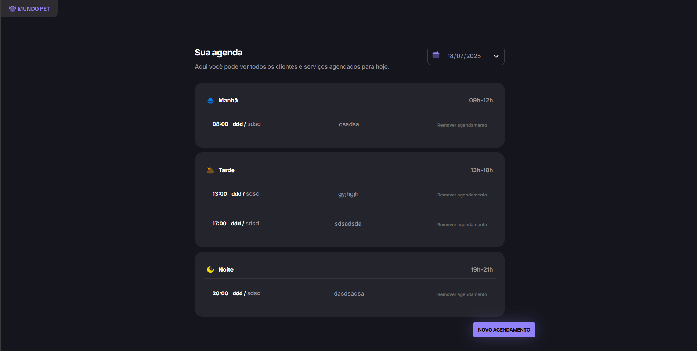
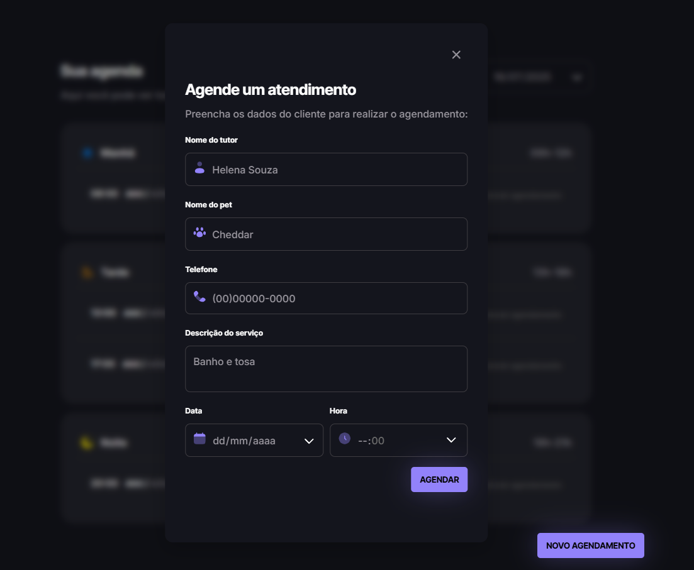
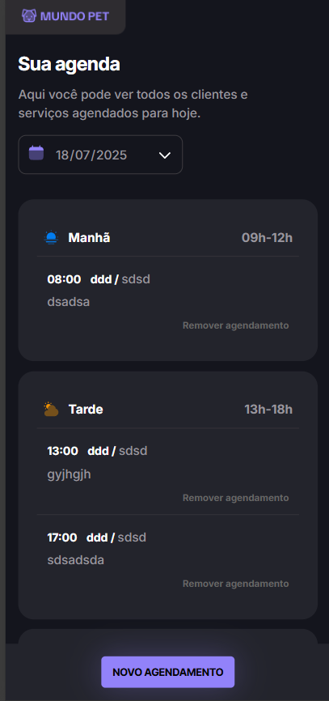

Aqui está o código completo do seu README com os links das imagens (badges) corrigidos, mantendo todo o restante do conteúdo e formatação original:

<h1 align="center" style="font-weight: bold;">🐾 PetShop Appointments</h1>

• <a href="#about">Sobre</a> •
• <a href="#tech">Tecnologias</a> •
• <a href="#installation">Instalação</a> •
• <a href="#started">Como Começar</a>

<b>
Uma aplicação web moderna para gestão de pet shops, projetada para agendar e gerenciar horários internamente. O projeto apresenta um pipeline de build robusto e simula um ambiente real através da integração com uma API REST.
</b>

<h2 id="about">📖 Visão Geral do Projeto</h2>

Este projeto foi desenvolvido para consolidar conceitos avançados do ecossistema JavaScript. Utiliza o <b>JSON-server</b> para simular uma API de backend e o <b>Webpack</b> para gerenciar o processo de build, compilando HTML, CSS e JS para produção. O <b>Babel</b> foi implementado para garantir a compatibilidade entre navegadores (ES6+), enquanto a arquitetura segue princípios de <b>modularização</b> para um código limpo e de fácil manutenção.

<h2 id="layout">🎨 Layout Desktop</h2>

<h2 id="layout">📱 Layout Mobile</h2>

<h2 id="tech">💻 Tecnologias</h2>

<ul>
<li><b>Core:</b> HTML5, CSS3, JavaScript (ES6+)</li>
<li><b>Tooling:</b> Webpack, Webpack Dev Server, Babel</li>
<li><b>Gerenciamento de Datas:</b> Day.js</li>
<li><b>API Simulada:</b> JSON-Server</li>
</ul>
<h2 id="installation">🔧 Instalação</h2>

Clone o repositório:

Bash
git clone https://github.com/FernandoCyber3/Agendamento-PetShop
Instale todas as dependências de uma vez: (Como você tem um package.json, não precisa instalar uma por uma)

Bash
npm install
<h2 id="started">🚀 Como Começar</h2>
Para rodar a aplicação, você precisa iniciar a API e o servidor de desenvolvimento:

Gere os arquivos de produção (Build):

Bash
npm run build 
Inicie a API Simulada (JSON-Server):

Bash
npm run server 
Inicie o ambiente de desenvolvimento:

Bash
npm run dev 

Desenvolvido com ☕ e foco em código limpo.

